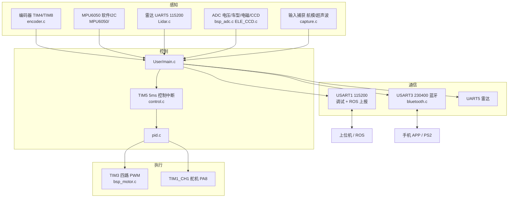
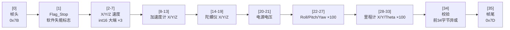
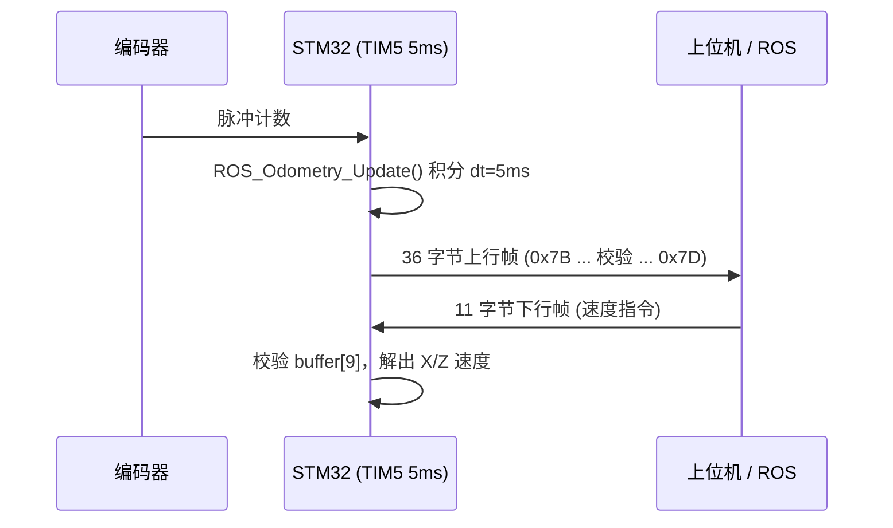

# Small-crawler-vehicle

轮趣科技（WHEELTEC）MiniBalance **V1.0**（2023-03-02）小车底层固件，运行于 STM32F103RC。
在原厂工程基础上新增了**向 ROS 侧上报里程计与 IMU** 的串口链路（`User/HARDWARE/usartx`）。

> 支持差速 / 阿克曼 / 履带多种车型，以及雷达避障与跟随、电磁与 CCD 巡线、蓝牙 / PS2 / 航模遥控等原厂功能。

---

## 硬件与开发环境

| 项 | 值 | 依据 |
|---|---|---|
| MCU | STM32F103RC | `Project/RVMDK（uv5）/MiniBalance.uvprojx` 中 `<Device>` |
| 开发环境 | Keil uVision5 | 工程文件 `MiniBalance.uvprojx` |
| 固件版本 | V1.0，2023-03-02 | `User/HARDWARE/usartx/usartx.c` 头部注释 |
| 原厂 | 轮趣科技（东莞）有限公司 / WHEELTEC | 全源码头部版权声明 |

---

## 系统结构

---

## 目录说明

| 目录 | 内容 |
|---|---|
| `User/` | 应用源码：`main.c`、`HARDWARE/`（外设驱动）、`CONTROL/`（控制逻辑）、`MPU6050/` |
| `Libraries/` | CMSIS 与 ST 标准外设库 |
| `Project/` | Keil uVision5 工程文件 |
| `Output/`、`Listing/` | **Keil 编译产物**（`.o` / `.axf` / `.hex` / `.map` 等，已被 git 跟踪） |
| `Doc/` | 原厂目录说明 `readme.txt` |

---

## ROS 上报协议（本项目新增部分）

串口参数：**USART1，115200**。相关实现在 `User/HARDWARE/usartx/usartx.c`。

### 上行帧（STM32 → 上位机），36 字节

逐字节对应关系（`usartx.c` 中 `USART1_SEND` 的打包顺序）：

| 字节 | 含义 |
|---|---|
| `buffer[0]` | 帧头 `FRAME_HEADER` = **0x7B** |
| `buffer[1]` | `Flag_Stop` 小车软件失能标志位 |
| `buffer[2..7]` | `X_speed` / `Y_speed` / `Z_speed`（各 2 字节，高字节在前） |
| `buffer[8..13]` | 加速度计 X / Y / Z |
| `buffer[14..19]` | 陀螺仪 X / Y / Z |
| `buffer[20..21]` | `Power_Voltage` 电源电压 |
| `buffer[22..27]` | `Roll` / `Pitch` / `Yaw`（×100） |
| `buffer[28..33]` | `Odometry_X` / `Odometry_Y` / `Odometry_Theta`（×100） |
| `buffer[34]` | `Check_Sum(34, 1)` —— 前 34 字节异或 |
| `buffer[35]` | 帧尾 `FRAME_TAIL` = **0x7D** |

### 下行帧（上位机 → STM32），11 字节

| 字节 | 含义 |
|---|---|
| `buffer[0]` | 帧头 `0x7B` |
| `buffer[3..4]` | X 速度指令 |
| `buffer[7..8]` | Z 速度指令（16 位短整型，÷1000） |
| `buffer[9]` | 校验，需满足 `== Check_Sum(9, 0)` |
| `buffer[10]` | 帧尾 `0x7D` |

### 里程计积分

`ROS_Odometry_Update()` 以 **5 ms** 为周期（`dt = 0.005f`）由编码器累加得到里程计，`Odometry_X/Y/Theta` 随上行帧发出。

---

## 外设分配

| 外设 | 引脚 / 配置 | 文件 |
|---|---|---|
| TIM3 四路 PWM（电机） | PA6 / PA7 / PB0 / PB1 | `bsp_motor.c` |
| TIM1_CH1（舵机） | PA8 | `bsp_GeneralTim.h` |
| TIM4 / TIM8（编码器） | PB6 / PB7、PC6 / PC7 | `encoder.c` |
| TIM5（控制中断） | 5 ms | `control.c` |
| USART1（调试 + ROS） | PA9 / PA10，115200 | `bsp_usart.c`、`usartx.c` |
| USART3（蓝牙） | PB10 / PB11，230400 | `bluetooth.c` |
| UART5（雷达） | PC12 / PD2，115200 | `Lidar.c` |
| ADC1 / ADC2 | 电压 PC1、车型 PC0、电磁 / CCD | `bsp_adc.c`、`ELE_CCD.c` |
| TIM2 / TIM1 输入捕获 | 航模 / 超声波 | `capture.c` |
| MPU6050 | 软件 I2C | `MPU6050/` |

---

## 编译与烧录

1. Keil uVision5 打开 `Project/RVMDK（uv5）/MiniBalance.uvprojx`
2. 选择目标 `MiniBalance`，Rebuild
3. 通过 ST-Link / J-Link 下载

仓库内未提供命令行构建脚本；编译产物落在 `Output/` 与 `Listing/`。

---

## 归属与许可证

- **本仓库未附带 LICENSE 文件**。
- 全部源码头部声明版权：
  **轮趣科技（东莞）有限公司 / WHEELTEC / All rights reserved**，
  版本 V1.0（2023-03-02），官网 wheeltec.net。
  即本工程主体为 **WHEELTEC 原厂固件**，相关权利归原作者所有。
- 本项目在原厂基础上的改动集中在 `User/HARDWARE/usartx/`（新增 ROS 里程计 / IMU 上报）。
- `Libraries/`（CMSIS、`FWlib`）为 STMicroelectronics 标准外设库，遵循其原始许可。

---

## 代码规模

| 范围 | 文件数 | 行数 |
|---|---|---|
| `User/`（应用源码） | 57 个 .c/.h | 约 15399 行 |
| 全仓库（不含 Libraries） | 58 个 .c/.h | — |

> 统计口径：仅 .c/.h/.s 源文件。`Output/`（166 个文件）与 `Listing/`（2 个文件）为 Keil 构建产物，已一并提交进仓库。
